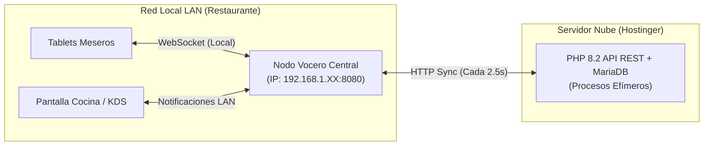
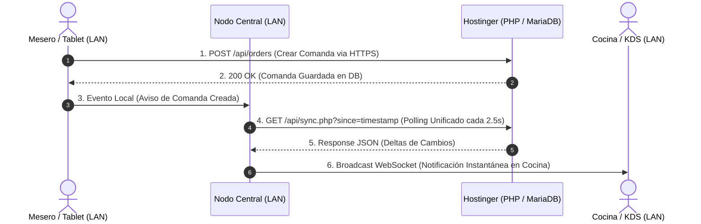
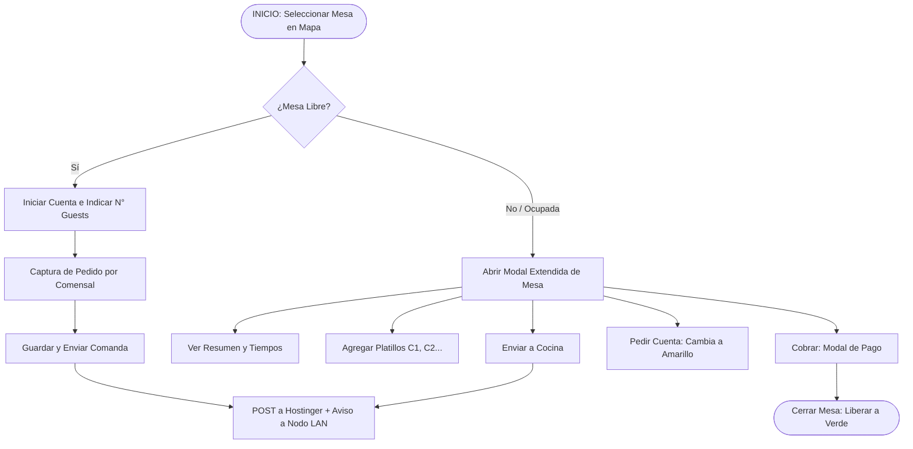

# IXEA BISTRO — PLAN MAESTRO DE ARQUITECTURA TÉCNICA Y ESPECIFICACIÓN DEL SISTEMA COMANDERO (SPA)

> **Versión:** 2.0.0 (Arquitectura Híbrida Nube/LAN) \
> **Estado:** Especificación Técnica Definitiva para Producción \
> **Entorno Nube:** Hostinger Shared Hosting (Apache HTTP Server + MariaDB) \
> **Entorno Local (Edge):** Nodo Central de Red LAN (Node.js / Python / PHP Local) \
> **Arquitectura Frontend:** Single-Page Application (SPA) en JavaScript Vanilla ES6+ (Táctil & Mobile First)

---

## 1. VISIÓN GENERAL Y PROPÓSITO DEL DOCUMENTO

El presente documento constituye la especificación técnica, de diseño, funcional y de infraestructura para el desarrollo del **Sistema Comandero Web de Ixea Bistro**. 

El sistema abandona los *frameworks* pesados del cliente (como React o Vue) para adoptar una **SPA ultra ligera construida en JavaScript Vanilla y PHP 8.2+**. Para maximizar el rendimiento de un servidor de hosting compartido y eliminar las limitaciones de procesos concurrentes, la arquitectura delega el streaming en tiempo real a un **Nodo Vocero Central dentro de la red local (LAN)**.



---

## 2. ARQUITECTURA TÉCNICA DEL SISTEMA (NUBE / LOCAL)

### 2.1 Stack Tecnológico e Infraestructura Híbrida

* **Servidor Nube (Persistencia & Core API):** Hostinger Shared Hosting (Apache HTTP Server con `mod_rewrite`, PHP 8.2+, MariaDB 10.5+ InnoDB). Opera bajo el principio *Stateless* ("ejecuta y muere") para un consumo mínimo de RAM y CPU.
* **Nodo Vocero Central (LAN Edge Node):** Equipo dedicado en la red local (PC de Caja o Mini PC en IP fija `192.168.1.XX`). Ejecuta un script liviano de comunicación bidireccional en tiempo real (Node.js con `ws` o Python/PHP CLI).
* **Frontend:** Single-Page Application (SPA) nativa en **JavaScript Vanilla (ES6+)**, HTML5 y Tailwind CSS (vía CDN/Build estático). Cero dependencias pesadas de procesamiento en el cliente.
* **Comunicación Híbrida:**
  * **Lecturas masivas y Escrituras Críticas:** Directamente desde los clientes (Tablets) hacia la API PHP en Hostinger vía HTTPS POST/GET.
  * **Sincronización en Tiempo Real (Sockets):** Exclusivamente a través del Nodo Vocero Central en la red local (LAN).

---

### 2.2 Diagrama de Flujo de Datos e Infraestructura



---

### 2.3 Estrategia de Configuración Servidor Nube (`.htaccess`)

```apache
# Configuración optimizada para Apache en Hostinger
<IfModule mod_rewrite.c>
    RewriteEngine On
    RewriteBase /

    # Redirección de llamadas API al frontal PHP
    RewriteRule ^api/(.*)$ api/index.php?request=$1 [QSA,L]

    # Redirección para Single Page Application (SPA)
    RewriteCond %{REQUEST_FILENAME} !-f
    RewriteCond %{REQUEST_FILENAME} !-d
    RewriteRule ^ index.html [L]
</IfModule>

# Deshabilitar listado de directorios
Options -Indexes

# Compresión GZIP para máxima velocidad en redes móviles
<IfModule mod_deflate.c>
    AddOutputFilterByType DEFLATE text/html text/plain text/xml text/css text/javascript application/javascript application/json
</IfModule>

# Encabezados CORS
<IfModule mod_headers.c>
    Header set Access-Control-Allow-Origin "*"
    Header set Access-Control-Allow-Methods "GET, POST, PUT, DELETE, OPTIONS"
    Header set Access-Control-Allow-Headers "Content-Type, Authorization, X-Requested-With"
</IfModule>
```

---

## 3. MECANISMO DE SINCRONIZACIÓN Y NODO VOCERO CENTRAL

### 3.1 Ciclo de Vida de la Petición y Registro de Interés

1. **Suscripción de Interés (LAN):** Al iniciar un módulo, cada Tablet registra sus necesidades de información en el Nodo Vocero Central enviando un paquete JSON local:
   $$\text{Interés Tablet A} = \{\text{zone\_id}: 1, \text{tables}: [1, 2, 3], \text{kds}: \text{false}\}$$
2. **Petición Agregada (Nodo Local $\rightarrow$ Hostinger):** El Nodo Central unifica los intereses activos de todas las tablets conectadas en la LAN y realiza **una sola petición consolidada** a la API PHP cada 2.5 segundos:
   `GET /api/sync.php?interests=tables:1,2,3|kds:true&since=1710002400`
3. **Consulta Eficiente en MariaDB (PHP):** El script `sync.php` en Hostinger ejecuta una consulta optimizada evaluando únicamente los registros cuya columna `updated_at` sea mayor a la marca de tiempo recibida.
4. **Broadcast LAN:** Si Hostinger devuelve cambios, el Nodo Central retransmite los deltas exclusivamente a los clientes suscritos en la red local a través de WebSockets (`ws://192.168.1.XX:8080`).

---

### 3.2 Protocolo de Resiliencia y Fallback Automático

Para garantizar que el restaurante jamás deje de operar ante un fallo del Nodo Central o cortes de luz/red:

| Escenario de Fallo | Impacto | Mecanismo de Recuperación Automático |
| :--- | :--- | :--- |
| **Caída del Nodo Central (PC apaga/reinicia)** | Pérdida temporal de transmisión en vivo (WebSockets LAN). | **Fallback a Polling Directo:** Las Tablets detectan la desconexión del WS en 5 segundos y conmutan automáticamente a realizar *polling* individual a Hostinger cada 5s. El sistema sigue funcionando. |
| **Corte de Internet (Hostinger inaccesible)** | Imposibilidad de sincronizar con la nube. | **Operación Offline Temp:** El Nodo Central asume el control de la DB localmente si cuenta con réplica o almacena las comandas en cola hasta la reconexión. |
| **Reconexión de Red** | Desincronización de estados. | El cliente reenvía las peticiones almacenadas en `IndexedDB` y consulta el último estado mediante timestamp. |

---

## 4. MODELO DE DATOS DETALLADO (MARIADB OPTIMIZADO)

```sql
CREATE DATABASE IF NOT EXISTS ixea_bistro_db CHARACTER SET utf8mb4 COLLATE utf8mb4_unicode_ci;
USE ixea_bistro_db;

-- 1. Zonas de Servicio
CREATE TABLE IF NOT EXISTS zones (
    id INT AUTO_INCREMENT PRIMARY KEY,
    name VARCHAR(50) NOT NULL,
    description VARCHAR(255) NULL,
    active TINYINT(1) DEFAULT 1,
    created_at TIMESTAMP DEFAULT CURRENT_TIMESTAMP,
    updated_at TIMESTAMP DEFAULT CURRENT_TIMESTAMP ON UPDATE CURRENT_TIMESTAMP,
    INDEX idx_zones_updated (updated_at)
) ENGINE=InnoDB;

-- 2. Usuarios y Roles
CREATE TABLE IF NOT EXISTS users (
    id INT AUTO_INCREMENT PRIMARY KEY,
    name VARCHAR(100) NOT NULL,
    role ENUM('manager', 'waiter', 'kitchen', 'cashier', 'admin') NOT NULL,
    pin_code VARCHAR(64) NOT NULL,
    active TINYINT(1) DEFAULT 1,
    created_at TIMESTAMP DEFAULT CURRENT_TIMESTAMP,
    updated_at TIMESTAMP DEFAULT CURRENT_TIMESTAMP ON UPDATE CURRENT_TIMESTAMP
) ENGINE=InnoDB;

-- 3. Mesas y Representación Gráfica
CREATE TABLE IF NOT EXISTS dining_tables (
    id INT AUTO_INCREMENT PRIMARY KEY,
    zone_id INT NOT NULL,
    table_number VARCHAR(10) NOT NULL,
    capacity INT DEFAULT 4,
    status ENUM('free', 'occupied', 'bill_requested', 'reserved', 'cleaning') DEFAULT 'free',
    assigned_user_id INT NULL,
    pos_x INT DEFAULT 0,
    pos_y INT DEFAULT 0,
    width INT DEFAULT 80,
    height INT DEFAULT 80,
    shape ENUM('square', 'round', 'rectangle') DEFAULT 'square',
    updated_at TIMESTAMP DEFAULT CURRENT_TIMESTAMP ON UPDATE CURRENT_TIMESTAMP,
    FOREIGN KEY (zone_id) REFERENCES zones(id) ON DELETE CASCADE,
    FOREIGN KEY (assigned_user_id) REFERENCES users(id) ON DELETE SET NULL,
    INDEX idx_tables_status_sync (status, updated_at)
) ENGINE=InnoDB;

-- 4. Categorías de Menú
CREATE TABLE IF NOT EXISTS categories (
    id INT AUTO_INCREMENT PRIMARY KEY,
    name VARCHAR(50) NOT NULL,
    sort_order INT DEFAULT 0,
    active TINYINT(1) DEFAULT 1,
    updated_at TIMESTAMP DEFAULT CURRENT_TIMESTAMP ON UPDATE CURRENT_TIMESTAMP
) ENGINE=InnoDB;

-- 5. Productos / Platillos
CREATE TABLE IF NOT EXISTS products (
    id INT AUTO_INCREMENT PRIMARY KEY,
    category_id INT NOT NULL,
    name VARCHAR(100) NOT NULL,
    description TEXT NULL,
    price DECIMAL(10,2) NOT NULL,
    area_destination ENUM('kitchen', 'bar', 'dessert') DEFAULT 'kitchen',
    active TINYINT(1) DEFAULT 1,
    updated_at TIMESTAMP DEFAULT CURRENT_TIMESTAMP ON UPDATE CURRENT_TIMESTAMP,
    FOREIGN KEY (category_id) REFERENCES categories(id) ON DELETE CASCADE,
    INDEX idx_products_updated (updated_at)
) ENGINE=InnoDB;

-- 6. Cuentas y Pedidos (Orders Header)
CREATE TABLE IF NOT EXISTS orders (
    id INT AUTO_INCREMENT PRIMARY KEY,
    service_type ENUM('piso', 'delivery', 'takeaway') NOT NULL DEFAULT 'piso',
    table_id INT NULL,
    waiter_id INT NOT NULL,
    customer_identifier VARCHAR(100) NULL,
    platform_name VARCHAR(50) NULL,
    status ENUM('open', 'closed', 'cancelled') DEFAULT 'open',
    subtotal DECIMAL(10,2) DEFAULT 0.00,
    discount_amount DECIMAL(10,2) DEFAULT 0.00,
    total DECIMAL(10,2) DEFAULT 0.00,
    opened_at TIMESTAMP DEFAULT CURRENT_TIMESTAMP,
    closed_at DATETIME NULL,
    updated_at TIMESTAMP DEFAULT CURRENT_TIMESTAMP ON UPDATE CURRENT_TIMESTAMP,
    FOREIGN KEY (table_id) REFERENCES dining_tables(id) ON DELETE SET NULL,
    FOREIGN KEY (waiter_id) REFERENCES users(id) ON DELETE CASCADE,
    INDEX idx_orders_sync (status, updated_at)
) ENGINE=InnoDB;

-- 7. Detalle de Pedidos / Comandas por Comensal
CREATE TABLE IF NOT EXISTS order_items (
    id INT AUTO_INCREMENT PRIMARY KEY,
    order_id INT NOT NULL,
    product_id INT NOT NULL,
    guest_number INT DEFAULT 1,
    unit_price DECIMAL(10,2) NOT NULL,
    notes VARCHAR(255) NULL,
    status ENUM('pending', 'sent', 'preparing', 'ready', 'delivered', 'cancelled') DEFAULT 'pending',
    sent_at DATETIME NULL,
    delivered_at DATETIME NULL,
    created_at TIMESTAMP DEFAULT CURRENT_TIMESTAMP,
    updated_at TIMESTAMP DEFAULT CURRENT_TIMESTAMP ON UPDATE CURRENT_TIMESTAMP,
    FOREIGN KEY (order_id) REFERENCES orders(id) ON DELETE CASCADE,
    FOREIGN KEY (product_id) REFERENCES products(id) ON DELETE CASCADE,
    INDEX idx_items_sync (order_id, status, updated_at)
) ENGINE=InnoDB;

-- 8. Transacciones y Pagos
CREATE TABLE IF NOT EXISTS payments (
    id INT AUTO_INCREMENT PRIMARY KEY,
    order_id INT NOT NULL,
    amount DECIMAL(10,2) NOT NULL,
    payment_method ENUM('cash', 'card', 'transfer') NOT NULL,
    tip_amount DECIMAL(10,2) DEFAULT 0.00,
    cashier_id INT NOT NULL,
    created_at TIMESTAMP DEFAULT CURRENT_TIMESTAMP,
    updated_at TIMESTAMP DEFAULT CURRENT_TIMESTAMP ON UPDATE CURRENT_TIMESTAMP,
    FOREIGN KEY (order_id) REFERENCES orders(id) ON DELETE CASCADE,
    FOREIGN KEY (cashier_id) REFERENCES users(id) ON DELETE CASCADE
) ENGINE=InnoDB;
```

---

## 5. MÓDULOS Y FUNCIONALIDADES DEL SISTEMA

### 5.1 Módulo 1: Gestión de Áreas y Zonas de Servicio
1. **Vista de Piso Interactivo (Canvas HTML5 / SVG Nativo):**
   - Renderizado ultrarrápido sin librerías externas.
   - Modos de color en tiempo real (*Verde = Libre*, *Rojo = Ocupada*, *Amarillo = Cuenta Pedida*, *Azul = Reservada*).
   - Conmutación de atención: **Mesero Asignado** vs **Atención Colmena Global**.
2. **Plataformas Delivery & Take Away:**
   - Panel Kanban ligero para gestión de pedidos externos (Rappi, UberEats, DDi, Servicio Propio).

### 5.2 Módulo 2: Comandero Táctil JS Vanilla
1. **Desglose por Comensal:**
   - Pestañas dinámicas ($C_1, C_2, C_3 \dots$).
   - Asignación inmediata de productos al comensal activo.
2. **Ciclo de Comanda:**
   - Modificadores rápidos ("Sin cebolla", "Término 3/4").
   - Envío a cocina optimizado: `POST` directo a Hostinger $\rightarrow$ Notificación instantánea vía Nodo Central a Pantalla KDS.

---

## 6. FLUJO OPERATIVO Y EVENTOS SPA



---

## 7. ESPECIFICACIÓN DEL NODO VOCERO CENTRAL (SCRIPT EN NODE.JS)

Este script se ejecuta en la máquina de la caja (`192.168.1.XX`) para unificar la comunicación de la red local:

```javascript
// server-nodo-central.js
const WebSocket = require('ws');
const http = require('http');

const PORT = 8080;
const HOSTINGER_SYNC_URL = '[https://tu-dominio.com/api/sync.php](https://tu-dominio.com/api/sync.php)';
let lastSyncTimestamp = Math.floor(Date.now() / 1000);

const wss = new WebSocket.Server({ port: PORT });
console.log(`[IXEA NODO CENTRAL] Servidor corriendo en puerto ${PORT}`);

// Almacén de clientes locales conectados
const clients = new Set();

wss.on('connection', (ws) => {
    clients.add(ws);
    ws.subscriptions = { tables: true, kds: true }; // Suscripción por defecto

    ws.on('message', (message) => {
        try {
            const data = JSON.parse(message);
            if (data.action === 'subscribe') {
                ws.subscriptions = data.interests;
            }
        } catch (e) {
            console.error('Error al procesar JSON cliente local', e);
        }
    });

    ws.on('close', () => clients.delete(ws));
});

// Bucle de sincronización con Hostinger (1 única petición para toda la red local)
setInterval(async () => {
    if (clients.size === 0) return; // Si no hay tablets encendidas, no gasta peticiones

    try {
        const response = await fetch(`${HOSTINGER_SYNC_URL}?since=${lastSyncTimestamp}`);
        const result = await response.json();

        if (result.has_changes) {
            lastSyncTimestamp = result.timestamp;
            
            // Retransmisión local (Broadcast a la LAN)
            const payload = JSON.stringify({ type: 'UPDATE_DELTA', data: result.data });
            clients.forEach((client) => {
                if (client.readyState === WebSocket.OPEN) {
                    client.send(payload);
                }
            });
        }
    } catch (error) {
        console.error('[SYNC ERROR] Fallo al conectar con Hostinger:', error.message);
    }
}, 2500);
```